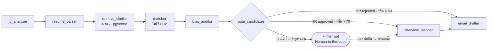

# TalentMatch AI

> ระบบผู้ช่วย HR คัดกรองเรซูเม่ด้วย **multi-agent LLM pipeline** ที่มี **มนุษย์เป็นผู้ตัดสินขั้นสุดท้าย**
> HR อัปโหลด Job Description และเรซูเม่ PDF เป็นชุด → ระบบแกะข้อมูล ให้คะแนนความเหมาะสม ตรวจอคติ แล้วร่างคำถามสัมภาษณ์หรืออีเมลตอบกลับ
> ผู้สมัครที่คะแนนก้ำกึ่งจะ **หยุดกราฟรอให้ HR ตัดสิน** แล้วเดินต่อจากจุดที่หยุด — ไม่รันใหม่ตั้งแต่ต้น

`Python 3.12` · `FastAPI` · `LangGraph` · `Google Gemini` · `PostgreSQL + pgvector` · `Next.js 14` · `TypeScript` · `Docker`

<details>
<summary><b>English summary</b></summary>

An HR resume-screening assistant built on a 7-node LangGraph agent pipeline. HR uploads a job description and a batch of PDF resumes; the graph parses both into a shared schema, scores each candidate deterministically, audits the criteria for bias, and drafts either interview questions or a response email.

The design centre is **human-in-the-loop**: candidates in the ambiguous 50–70 band interrupt the graph and wait for a human decision, then **resume from the interrupt rather than re-running** — 2 LLM calls per decision instead of 4+, with state persisted in PostgreSQL so it survives a full server restart. A recorded HR decision always outranks the score, so a human can overturn any automatic outcome.

</details>

---

## ทำไมโปรเจกต์นี้ถึงน่าสนใจ

โปรเจกต์นี้ไม่ได้ "เรียก LLM ให้อ่านเรซูเม่แล้วให้คะแนน" — สามการตัดสินใจหลักคือ

| การตัดสินใจ | เหตุผล |
| --- | --- |
| **คะแนนไม่ได้มาจาก LLM** | `matcher` เป็นโค้ด Python ล้วน (required 60% + preferred 40%) ผลคงที่ ทำซ้ำได้ และอธิบายให้ผู้สมัครฟังได้ว่าตกเพราะขาดทักษะข้อไหน · เป็นการกันอคติที่ต้นทางด้วย เพราะสูตรคะแนนไม่เห็นเพศ อายุ หรือชื่อสถาบันเลย |
| **HITL เป็น *resume* ไม่ใช่ *rerun*** | ใช้ `PostgresSaver` เป็น checkpointer + `interrupt_before` โดยมี `candidate_id` เป็น `thread_id` · การกดอนุมัติใช้ LLM **2 ครั้งพอดี** (planner + drafter) ถ้ารันใหม่จากต้นจะเห็น 4+ ครั้ง |
| **embedding ใช้จัดอันดับ ไม่ใช้ตัดสิน** | วัด cosine similarity แล้วพบว่า PostgreSQL↔MySQL = **0.885** และ Java↔JavaScript = **0.865** ซึ่ง*สูงกว่า*คู่ที่ควรแมตช์จริงอย่าง React Native↔Mobile Hybrid = **0.838** → ไม่มี threshold ใดแยกได้ จึงจำกัดบทบาทเวกเตอร์ไว้ที่การค้นหาและแนะนำเท่านั้น |

---

## สถาปัตยกรรม

ทั้งระบบคือ **กราฟเดียว สถานะเดียว** — object ชื่อ `HRSystemState` ไหลผ่านทุกโหนด แต่ละโหนดเป็น pure transformer ไม่มีโหนดไหนเขียนฐานข้อมูลเอง (การเขียน DB อยู่ใน `runner.py`)



**กฎของ router (หัวใจของโปรดักต์):** เงื่อนไขแรกที่เช็คคือ *"มีคำตัดสินของ HR หรือยัง"* — ไม่ใช่คะแนน คนที่ AI ตัดทิ้งอัตโนมัติก็ยังถูกดึงกลับได้ ระบบจะย้อนสถานะกราฟ (`update_state(as_node=...)`) ให้ router ตัดสินใหม่โดยมีคำตัดสินของมนุษย์อยู่ในมือ

**เกณฑ์คะแนนอยู่ที่เดียว:** `app/agents/bands.py` — เลข 50/70 เคยกระจายอยู่ 6 ที่ ทำให้ย้ายเส้นแบ่งทีหนึ่งแล้วสีป้ายบนหน้าเว็บไม่ตรงกับเส้นทางที่กราฟเดินจริง

---

## ฟีเจอร์

- **อัปโหลดเป็นชุดแบบ async** — สกัดข้อความด้วย `pdfplumber` บันทึกแถวผู้สมัครทันทีแล้วตอบกลับ กราฟรันเบื้องหลัง หน้าเว็บ poll เอา
- **Human-in-the-Loop** — คะแนน 50–70 หยุดรอคนตัดสิน พร้อมโน้ตของ HR · สถานะรอดจากการรีสตาร์ตเซิร์ฟเวอร์
- **คำถามสัมภาษณ์พร้อมแนวคำตอบที่คาดหวัง** — เขียนให้ HR ที่ไม่ใช่สายเทคนิคใช้ตัดสินได้
- **ตรวจอคติ** — auditor ตรวจเกณฑ์และภาษาใน JD ว่าอ้างอิงคุณสมบัติที่ไม่เกี่ยวกับงานหรือไม่
- **ค้นหาเชิงความหมาย (pgvector)** — พิมพ์ไทยค้นเรซูเม่อังกฤษได้ · HNSW cosine index, 768 มิติ
- **RAG หาผู้สมัครโปรไฟล์คล้ายกัน** — เปิด/ปิดด้วย `RAG_ENABLED` (ปิดแล้วโหนดยังอยู่ในกราฟแต่เป็น no-op รูปกราฟจึงไม่เปลี่ยน สำคัญเพราะ checkpoint ผูกกับรูปกราฟ)
- **ส่งอีเมลจริง (SMTP)** — ระบบร่างให้ แต่ HR ต้องยืนยันผู้รับ/หัวข้อ/เนื้อความเองก่อนกดส่ง · dev ยิงเข้า MailHog
- **วงจรชีวิตตำแหน่งงาน** — ปิดรับสมัคร (แนะนำ) หรือลบถาวร (มีการ์ดกัน: ส่งอีเมลแล้วลบไม่ได้, กราฟกำลังรันลบไม่ได้)
- **ทะเบียนพนักงาน** — ผู้สมัครที่รับเข้าทำงานถูกบันทึกเป็นพนักงาน พร้อมสถานะทดลองงาน/ประจำ/พ้นสภาพ
- **กู้เคสวิเคราะห์ค้าง** — ผู้สมัครที่ค้างเกิน 90 วินาทีขึ้นป้าย "ค้าง" พร้อมปุ่มวิเคราะห์ใหม่ แทนที่จะขึ้น "กำลังวิเคราะห์…" ตลอดกาล
- **Auth + LangSmith tracing** — JWT ปิดทุก endpoint · tracing เปิดด้วย env ไม่ต้องแก้โค้ด

---

## เริ่มใช้งาน

ต้องมี **Docker Desktop** และ **Gemini API key** ([ขอฟรีที่ Google AI Studio](https://aistudio.google.com/apikey))

```bash
git clone <repo-url> && cd HR_Project

# 1. ตั้งค่า environment
cp backend/.env.example backend/.env
#    แก้ backend/.env ใส่ GOOGLE_API_KEY ของตัวเอง (บรรทัดอื่นมีค่าดีฟอลต์อยู่แล้ว)

# 2. รันทั้งระบบ (db + backend + frontend + mailhog)
docker compose up --build
```

| บริการ | URL | หมายเหตุ |
| --- | --- | --- |
| หน้าเว็บ | http://localhost:4000 | ล็อกอินด้วย `admin` / `admin1234` (dev) |
| API docs | http://localhost:8080/docs | Swagger UI |
| กล่องอีเมล (dev) | http://localhost:8025 | MailHog — ดูอีเมลที่ระบบส่ง |

> **ทำไมพอร์ต 4000 กับ 8080 ไม่ใช่ 3000/8000** — บน Windows ช่วงพอร์ตดังกล่าวถูก WinNAT จองไว้ทำให้ bind ไม่ได้ · คอนเทนเนอร์ยังฟังที่ 3000/8000 ภายในเหมือนเดิม

### ลองด้วยข้อมูลตัวอย่าง

`backend/sample_data/` มีเรซูเม่ PDF 3 ใบที่ออกแบบให้ตกคนละแบนด์ — `strong_somchai` (ผ่านอัตโนมัติ), `mid_suda` (หยุดรอ HR ตัดสิน), `weak_anan` (ปฏิเสธอัตโนมัติ) สร้างตำแหน่งงานที่ต้องการ Python/FastAPI/PostgreSQL แล้วอัปโหลดทั้งสามใบเพื่อเห็นครบทุกเส้นทางของ router

### รันเทส

```bash
docker compose exec backend python -m pytest tests/ -v
```

---

## โครงสร้างโปรเจกต์

```
backend/app/
├── agents/
│   ├── graph.py        # ประกอบกราฟ + route_candidates (หัวใจการตัดสินเส้นทาง)
│   ├── runner.py       # รันกราฟ, HITL resume/rewind, เขียนผลลง DB
│   ├── state.py        # HRSystemState — นิยามเดียวที่ทุกโหนดใช้ร่วมกัน
│   ├── bands.py        # เกณฑ์ 50/70 อยู่ที่นี่ที่เดียว
│   ├── skills.py       # เทียบทักษะบนขอบเขตคำ + ตารางคำพ้อง/การครอบคลุม
│   ├── models.py       # Pydantic schema ของ output ทุกโหนด
│   └── nodes/          # 7 โหนด
├── routers/            # jobs · candidates · hr · auth · employees
├── vectors.py          # pgvector: index / search
├── auth.py             # JWT + bcrypt + rate-limit login
├── email_sender.py     # SMTP (header-injection safe)
└── schema.sql          # DDL — สร้างตารางแบบ idempotent ตอนบูต

frontend/               # Next.js 14 App Router + Tailwind + SWR
brief/                  # เอกสารสเปคตั้งต้น (ภาษาไทย)
memory-bank/            # บันทึกความคืบหน้า การตัดสินใจ และกับดักที่เจอ
```

---

## บันทึกจากการพัฒนา (สิ่งที่เรียนรู้)

**บั๊กการเทียบทักษะแบบ substring** — โค้ดเวอร์ชันแรกเทียบด้วย `n in o or o in n` ผลคือทักษะ `R` ถูกนับว่าตรงกับ `docke`**`r`**, `redis` และ `postg`**`r`**`esql` ส่วน `ML` ตรงกับ `ht`**`ml`** เจอตอนไล่ดูข้อมูลจริงในฐานข้อมูล → เขียนใหม่ให้เทียบบนขอบเขตคำ พร้อมตารางคำพ้อง (`NodeJs` = `Node.js`) และตารางการครอบคลุมแบบทางเดียว (PostgreSQL ⟹ SQL แต่ SQL ⇏ PostgreSQL) คุมด้วยเทส 32 เคส

**ปุ่ม HITL ที่กดแล้วไม่มีอะไรเกิดขึ้น** — `resume_after_decision` เดิมรองรับเฉพาะกรณีกราฟค้างอยู่ที่ interrupt ตรวจสถานะผู้สมัครจริงทั้ง 15 คนแล้วพบว่ามีเพียงคนเดียวที่ปุ่มใช้งานได้ ที่เหลือกราฟจบไปแล้ว → API ตอบ 200 และหน้าเว็บบอกว่าสำเร็จทั้งที่ไม่มีอะไรรัน เคสที่เจ็บที่สุดคือคะแนนต่ำกว่า 50 ซึ่งไม่เคยแวะ interrupt เลย จึงกู้ไม่ได้ตลอดกาล → เพิ่มกิ่ง rewind ด้วย `update_state(as_node="bias_auditor")`

**Checkpointer ต้องอยู่บน Postgres** — เอกสารตั้งต้นเขียน `SqliteSaver(":memory:")` ซึ่งทำให้ HITL พังทั้งฟีเจอร์เพราะสถานะตายพร้อมโปรเซส

**โควตา LLM เป็นข้อจำกัดเชิงสถาปัตยกรรม** — Gemini free tier ให้ 20 request/วันต่อโมเดล ทดสอบ e2e รอบเดียวก็หมด ข้อจำกัดนี้บังคับให้ออกแบบให้ประหยัดตั้งแต่แรก: แกะ JD ครั้งเดียวต่อตำแหน่งแทนที่จะแกะซ้ำต่อผู้สมัคร และ resume แทน rerun

**ตรวจ UI ด้วยภาพ ไม่ใช่ status code** — หน้าเว็บเป็น client component ที่ตอบ 200 พร้อมข้อความ "กำลังโหลด…" เสมอ บั๊กที่ป้ายสถานะไม่มีสีพื้นหลัง (Tailwind ไม่ scan `lib/` ที่เก็บชื่อคลาสไว้) เจอได้จากการดูภาพเท่านั้น

---

## ข้อจำกัดที่รู้อยู่

| ข้อจำกัด | สาเหตุ | ทางแก้ที่วางไว้ |
| --- | --- | --- |
| ยังไม่ได้ deploy จริง | ไม่มี TLS · container รันด้วย root · secret อยู่ในไฟล์ env | reverse proxy + non-root user + secrets manager |
| ข้อความภาษาไทยใน PDF เพี้ยน | `pdfplumber` เรียง glyph ตามพิกัด สระ/วรรณยุกต์ไทยจึงสลับตำแหน่ง (กระทบชื่อ ไม่กระทบคะแนน) | เปลี่ยนตัวอ่านเป็น `pypdfium2` |
| งานเบื้องหลังตายพร้อมโปรเซส | `BackgroundTasks` อยู่ใน process เดียวกับ API | มีป้าย "ค้าง" + ปุ่มวิเคราะห์ใหม่แล้ว · ระยะยาวย้ายไป job queue (Celery/RQ + Redis) |
| อัปโหลดไฟล์เดิมซ้ำไม่ถูกตรวจจับ | ยังไม่เทียบเนื้อหาตอนอัปโหลด | เทียบ hash ของข้อความที่สกัดได้ |
| rate-limit login เก็บในหน่วยความจำ | ตัวนับอยู่ในโปรเซส | ย้ายไป Redis ก่อนรันหลาย replica |

**ความเป็นส่วนตัว:** เนื้อหาเรซูเม่ถูกส่งไปประมวลผลที่ Google Gemini API — การใช้งานจริงต้องแจ้งผู้สมัครและขอความยินยอมก่อน หรือเปลี่ยนไปใช้โมเดลที่รันในองค์กร

---

## แผนถัดไป

1. ทำให้เป็น **agent loop** จริง — เมื่อ `bias_auditor` ติดธง ให้ส่งกลับไปคำนวณคะแนนใหม่ 1 รอบ (จำกัดรอบเพื่อคุมโควตา)
2. กันอัปโหลดซ้ำที่ต้นทางด้วยการเทียบ hash
3. Deploy จริงพร้อม TLS และย้าย rate-limit ไป Redis
4. แก้การอ่าน PDF ภาษาไทย
5. วัดผลกับผู้ใช้จริง — เทียบเวลาและความสอดคล้องของการคัดเลือกระหว่างใช้ระบบกับไม่ใช้
