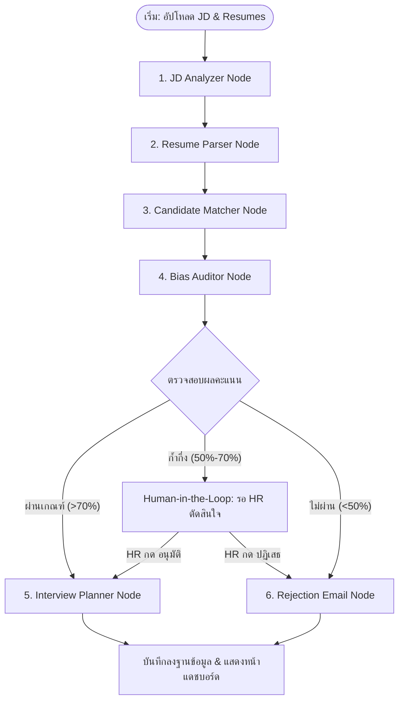

# TalentMatch AI: Project Brief & Architecture Specification

ระบบวิเคราะห์และคัดกรองใบสมัครงานอัจฉริยะด้วยทีม AI Multi-Agent โดยใช้ LangGraph, FastAPI และ Next.js

---

## 📌 1. ข้อมูลทั่วไปของโปรเจค (Project Overview)
*   **เป้าหมาย**: พัฒนาระบบช่วยเหลือ HR ในการคัดกรองใบสมัครงาน (Resume) เปรียบเทียบกับรายละเอียดตำแหน่งงาน (Job Description - JD) ตรวจจับอคติ (Bias) ออกแบบคำถามสัมภาษณ์เฉพาะบุคคล และทำระบบโต้ตอบทางอีเมลอัตโนมัติ โดยมีระบบ Human-in-the-Loop เพื่อให้มนุษย์ตัดสินใจในจุดก้ำกึ่ง
*   **กลุ่มเป้าหมายหลัก**: เจ้าหน้าที่สรรหาบุคลากร (HR Recruiter)

---

## 🛠️ 2. เทคโนโลยีที่ใช้ (Tech Stack)
*   **AI Orchestration**: Python 3.10+, **LangGraph** (State & Flow Management), **LangChain** (LLM Integration)
*   **LLM API**: **Gemini 1.5 Flash** (ประมวลผลเร็ว ประหยัดค่าใช้จ่าย) และ **Gemini 1.5 Pro** (ใช้ในจุดวิเคราะห์ซับซ้อน)
*   **Backend Framework**: **FastAPI** (Python) รองรับ Asynchronous และ Auto Swagger UI
*   **Database & Memory**: **Supabase (PostgreSQL)** + **pgvector** (เก็บบันทึกข้อมูลผู้สมัคร, ผลการตัดสินใจ และความจำของ Agent)
*   **Frontend UI**: **Next.js (React)** + **Vanilla CSS / Tailwind**
*   **Debugging & Evaluation**: **LangSmith** (สำหรับตรวจเช็คการทำงาน ความหน่วง ค่าใช้จ่าย และความแม่นยำของ Agent)

---

## 📊 3. แผนผังการทำงานของระบบ (System Workflow)



---

## 🗂️ 4. โครงสร้างหน่วยความจำระบบ (LangGraph State Schema)

ตัวแปรส่วนกลางที่จะไหลผ่านทุก Node ในระบบ มีโครงสร้างดังนี้:

```python
from typing import TypedDict, List, Dict, Any, Optional

class HRSystemState(TypedDict):
    # --- Inputs ---
    raw_jd: str  # ข้อความประกาศงานดิบ
    raw_resumes: List[Dict[str, Any]]  # รายการไฟล์ Resume (ชื่อไฟล์ + ข้อความดิบ)

    # --- Parsed Data ---
    analyzed_jd: Optional[Dict[str, Any]]  # ข้อมูล JD ที่แยกประเภทแล้ว
    parsed_resumes: List[Dict[str, Any]]  # ข้อมูล Resume ที่แกะเป็น JSON แล้ว

    # --- AI Assessment ---
    evaluations: List[Dict[str, Any]]  # ผลคะแนน ความสอดคล้อง และผลเช็ค Bias

    # --- Human-in-the-Loop State ---
    hr_decision: Dict[str, str]  # สถานะตัดสินใจของ HR เช่น {"candidate_A": "approved"}
    hr_notes: Dict[str, str]     # คอมเมนต์จาก HR เช่น {"candidate_A": "คุยต่อรอบสอง"}

    # --- Outputs ---
    interview_plans: Dict[str, Any]  # คำถามสัมภาษณ์เฉพาะบุคคล
    email_drafts: Dict[str, Any]     # ร่างอีเมลติดต่อกลับ
```

---

## 🤖 5. รายละเอียดแต่ละ Node ของ Agent

### Node 1: `jd_analyzer`
*   **หน้าที่**: แปลง JD เป็น Structured Data
*   **Pydantic Schema Output**:
    ```python
    class JobRequirement(BaseModel):
        job_title: str
        min_experience_years: int
        required_skills: List[str]
        preferred_skills: List[str]
        responsibilities: List[str]
    ```

### Node 2: `resume_parser`
*   **หน้าที่**: แกะข้อมูล Resume ผู้สมัครทุกคนให้จัดอยู่ในรูปแบบเดียวกันกับ JobRequirement เพื่อความง่ายในการเปรียบเทียบ

### Node 3: `candidate_matcher`
*   **หน้าที่**: วิเคราะห์ส่วนต่าง (Gap Analysis) และคำนวณคะแนนประเมิน (Fit Score) 0-100%

### Node 4: `bias_auditor`
*   **หน้าที่**: ตรวจสอบรายงานของ Matcher และข้อความดั้งเดิมใน Resume เพื่อกำจัดอคติทางเพศ อายุ เชื้อชาติ และสถาบันการศึกษา เพื่อให้การคัดเลือกเป็นกลางที่สุด

### Node 5: `interview_planner`
*   **หน้าที่**: นำผลประเมินและประวัติผู้สมัครที่ผ่านเกณฑ์มาตั้งคำถามสัมภาษณ์ 5-7 ข้อเฉพาะบุคคล โดยพุ่งเป้าไปที่ส่วนที่ผู้สมัครยังขาดในใบสมัคร

### Node 6: `rejection_drafter`
*   **หน้าที่**: เขียนร่างอีเมลปฏิเสธอย่างสุภาพ โดยกล่าวถึงจุดดีที่ประทับใจของผู้สมัครและเปิดโอกาสในอนาคต

---

## 📈 6. ขั้นตอนการนำไปพัฒนาจริง (Implementation Roadmap)

### เฟส 1: การออกแบบ Schemas และการวิเคราะห์เอกสาร (Week 1)
*   [ ] ออกแบบ Pydantic Class สำหรับวิเคราะห์ JD และ Resume
*   [ ] เขียนโค้ดสกัดข้อความจากเอกสาร PDF/Docx
*   [ ] ตรวจสอบความถูกต้องของการแปลงผลผ่าน LLM

### เฟส 2: การพัฒนา LangGraph Core (Week 2)
*   [ ] สร้าง Node และดราฟต์ System Prompt ของแต่ละ Agent
*   [ ] กำหนด Router แยกทิศทางตามเงื่อนไขคะแนน
*   [ ] ติดตั้งระบบ Checkpointer ของ LangGraph ในการบันทึก State
*   [ ] ทดสอบระบบ Human-in-the-Loop (Interrupt) รันผ่าน Terminal

### เฟส 3: การเชื่อมต่อ API & Database (Week 3)
*   [ ] พัฒนา FastAPI Endpoint สำหรับอัปโหลดไฟล์ สั่งรัน Graph และดึงประวัติ
*   [ ] เชื่อมต่อฐานข้อมูล Supabase เพื่อเก็บ State และข้อมูล HR
*   [ ] เปิดการทำ Tracing บน LangSmith เพื่อตรวจเช็คความผิดพลาดของ Prompt

### เฟส 4: พัฒนา Frontend UI & Dashboard (Week 4)
*   [ ] พัฒนาหน้าเว็บสำหรับการตั้งค่าตำแหน่งงาน (JD Input)
*   [ ] สร้างหน้าบอร์ดแดชบอร์ดแสดงอันดับผู้สมัคร (Candidate Leaderboard)
*   [ ] สร้างหน้าจอสำหรับตรวจประวัติแบบละเอียด ปุ่มกด Approve/Reject และดูคำถามสัมภาษณ์

---

## 🧪 7. แผนการตรวจสอบและวัดผล (Testing & Evaluation Plan)
*   **การทดสอบระบบ**: นำตัวอย่าง Resume จำนวน 10-20 รูปแบบ (มีทั้งตรงสเปก, ไม่ตรง, ก้ำกึ่ง และข้อมูลขาดหาย) มารันผ่านระบบ
*   **การวัดผลใน LangSmith**:
    *   สร้าง Dataset ของผลลัพธ์ที่ถูกต้อง (Ground Truth)
    *   รันประเมินความถูกต้อง (Accuracy Evaluator) ของการสกัดทักษะและการให้คะแนน
    *   วิเคราะห์ความเร็ว (Latency) และค่าบริการ API ต่อหนึ่งครั้งของการวิเคราะห์
